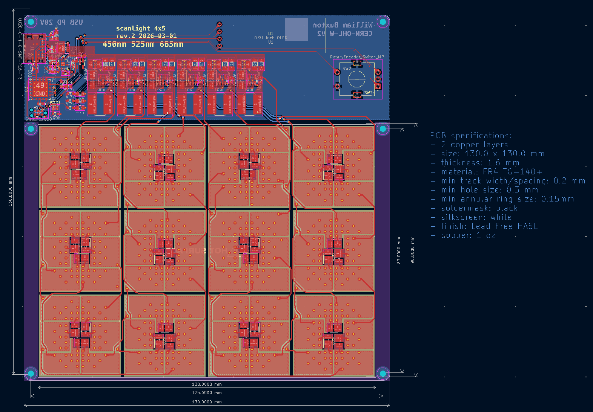

# A Better Large Format Light Source For Scanning Color Negative Film

<small>Originally published by [jackw01](https://github.com/jackw01/scanlight) on 2024-08-05, forked 2025-03-20</small>

## tl;dr

Read [Jack's GitHub Page](https://jackw01.github.io/scanlight/) for the theory behind the project.

# Major Changes

This fork is a major redesign of the Scanlight project. 
The main purpose is to expand the size to allow for scanning 4x5 large format film. 

The number of LEDs have been doubled to 12 per color (deep red 660nm; green 525nm; royal blue 450nm) and the 3D printed shroud has been adjusted likewise.
A slightly different [red led](https://www.digikey.ch/en/products/detail/lumileds/L1SP-DRD0002800000/9805570) has been chosen 
to better match the [Spectral-Sensitivity Curve of Portra 160](https://business.kodakmoments.com/sites/default/files/files/resources/e4051_Portra_160.pdf) (and it is cheaper at the time of writing).

This project incorporates a microcontroller (STM32G0B1) which more precisely controls the brightness of each LED channel.
This can be stored through power off states for repeatable scans. 
Additionally, the microcontroller is responsible for USB-PD (20V is necessary, 1.25A approximate maximum)

[Schematic (PDF)](pcb/schematic.pdf)

[BOM](pcb/bom/ibom.html)

#### Build Notes

The PCB should be fabricated similar to [jackw01/scanlight](https://github.com/jackw01/scanlight), that is a black soldermask and white silkscreen. 

As modified, only a 20V-capable USB PD supply can be used. All parts were sourced on DigiKey.

### The Diffuser

The diffuser stack up has not changed from [jackw01/scanlight](https://github.com/jackw01/scanlight).
Only the 3D printed enclosure has been enlarged. 

I printed the parts in black PETG and installed aluminum tape on the insides to improve efficiency.

Additional parts: 
- 4x M2x6mm socket head cap screws
- 4x M2x10mm socket head cap screws
- 8x M2 square nuts (DIN 562)

### Status and the Future

The code has not been finalized. 
USB-PD and the dimming of the LEDs are working as expected. 
I have not implemented the screen or rotary encoder input. 

In the distant future I plan on incorporating this into my enlarger to print 4x5 (and 120) negatives.
I no longer shoot 35mm and probably will not produce a 35mm mask for scanning and printing.
If you only shoot 35mm I recommend using Jack's design as it is smaller and cheaper. 

## license

The PCB schematic, layout, and Gerber files and the 3D CAD files for this project are released under the CERN Open Hardware Licence Version 2 - Weakly Reciprocal (CERN-OHL-W V2). 
